

  <h1>Hi and Welcome !! 👋</h1>
  <h2>Management Team 👥</h2>

  <table>
    <tr>
      <td align="center">
        <a href="https://github.com/jbampton"> 
           
          <strong>CEO and Founder 🏢</strong> 
          John Bampton  
        </a>
      </td>
      <td align="center">
        <a href="https://github.com/BaseMax">
           
          <strong>Chief Technology Officer 💻</strong> 
          Max Base  
        </a>
      </td>
      <td align="center">
        <a href="https://github.com/johnbampton"> 
           
          <strong>Office Cleaner 🧹</strong> 
          Beast   
        </a>
      </td>
    </tr>
  </table>

  

  <h2>Invite on "Star" 🌠</h2>

Add a `Star` to the [repository](https://github.com/john-bampton/.github) and you will be sent an email invitation to join the `John Bampton` GitHub Organization ⏩ 🏦

  <h2>Organizations We Run 🏢</h2>
  

    
    
    
    
    
    
    
    
    
    
    
    
    
  

  <h2>Organizations We Support 🤝</h2>
  

    
    
    
    
  

  <h2>We Donate Here ❤️</h2>

  <h3><a href="https://www.compassion.com.au/">Compassion</a> is a Christian international holistic child development organisation</h3>
  <a href="https://www.compassion.com.au/gifts-of-compassion/fruit-and-veggie-seeds-10-pack">
    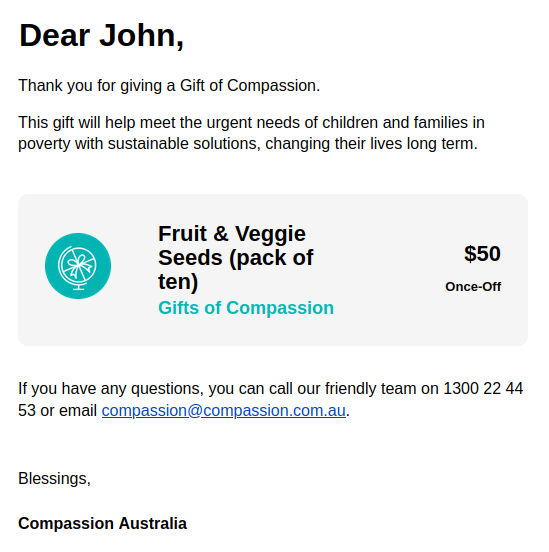
  </a>

  <h3>The <a href="https://www.flyingdoctor.org.au/">RFDS</a> is a national, charitable, health organisation delivering primary healthcare and 24-hour emergency services for those that live in rural and remote Australia.</h3>
  <a href="https://www.flyingdoctor.org.au/">
    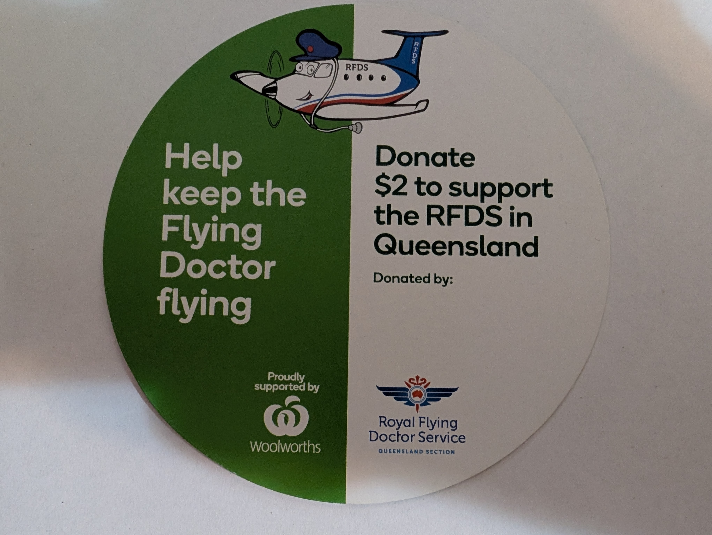
    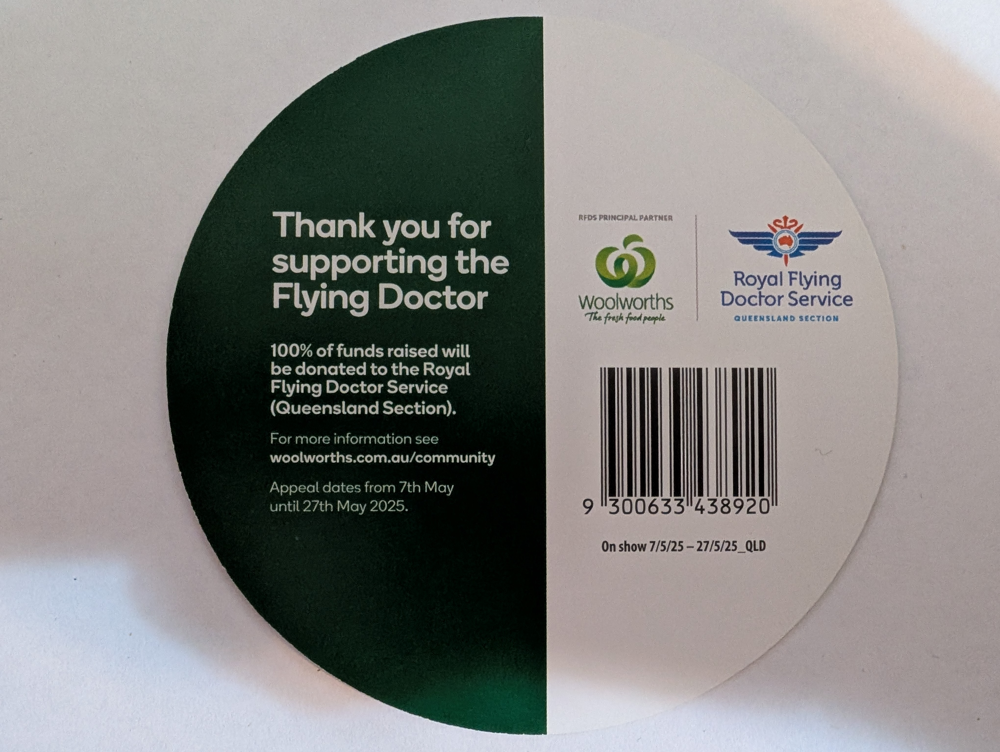
  </a>

  <h3><a href="https://www.oxfam.org.au/">Oxfam</a> is an international charity and global movement dedicated to tackling the root causes of poverty.</h3>
  <a href="https://unwrapped.oxfam.org.au/">
    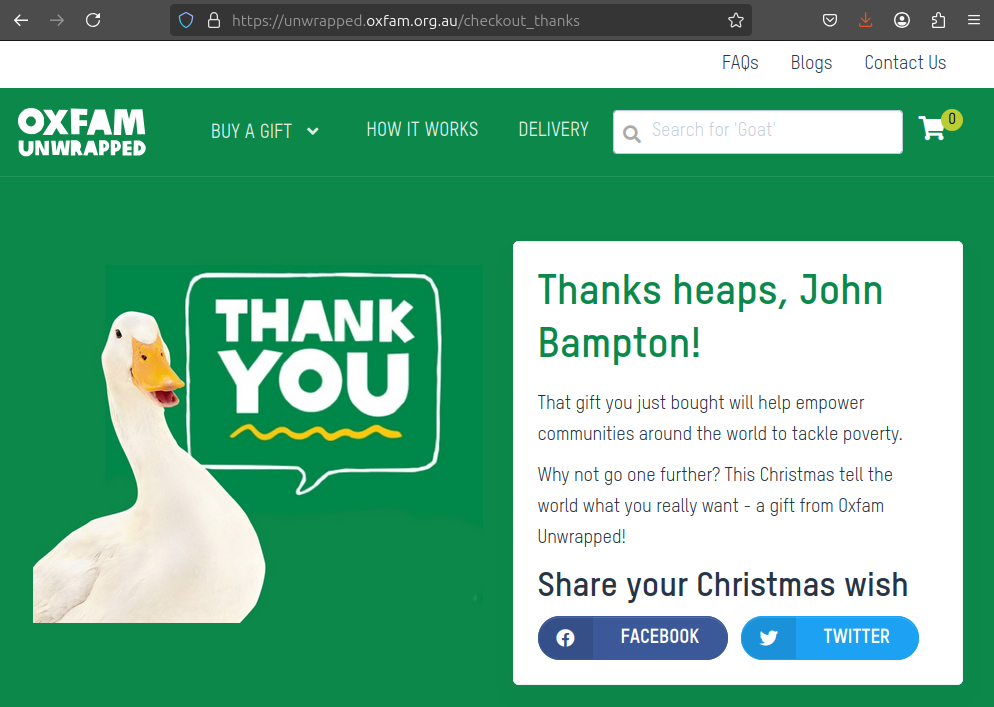
  </a>

  <h3><a href="https://www.caritas.org.au/">Caritas Australia</a> is an Australian Catholic agency for development cooperation and humanitarian aid.</h3>
  <a href="https://www.caritas.org.au/">
    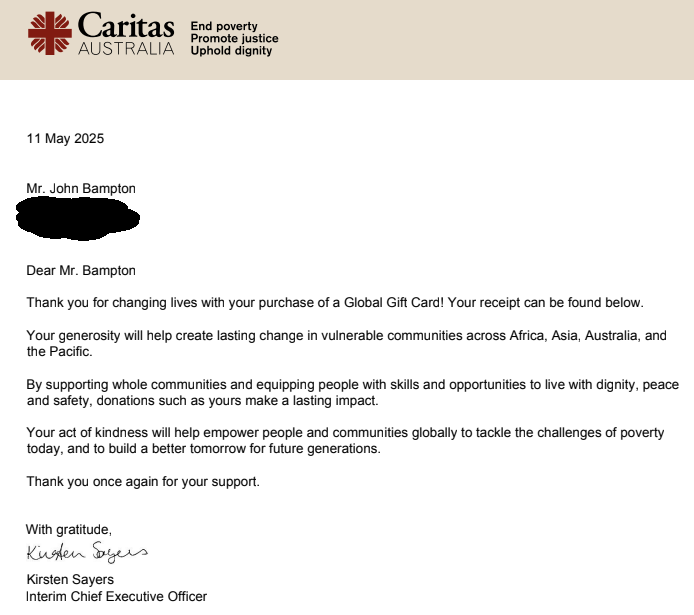
  </a>

  <h3><a href="https://opencollective.com/">Open Collective</a> is a crowdfunding platform focused on grassroots groups.</h3>
  <a href="https://opencollective.com/john-bampton">
    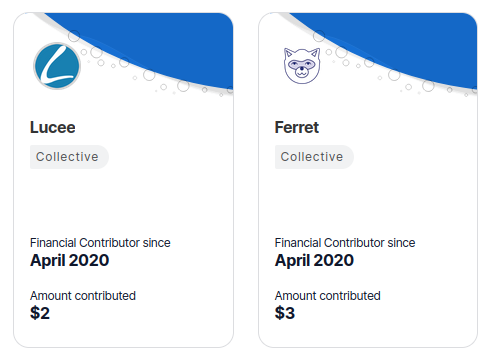
  </a>

  <h2>John's friends 👯</h2>

<!-- https://github.com/BaseMax/github-name-friends -->

- [Amir](https://github.com/amir-shiati)
- [Amir Tallap](https://github.com/AmirTallap)
- [Anderson García](https://github.com/Anderson-Garcia)
- [Anuradha Fernando](https://github.com/anufdo)
- [Ayush Rana](https://github.com/ayushrana182)
- [basalumutgazi](https://github.com/basalumutgazi)
- [Clay Lanzino](https://github.com/ClayLanzino)
- [Daniel Araica](https://github.com/DanielAraica)
- [Emeka](https://github.com/janus)
- [Giacomo Sorbi](https://github.com/GiacomoSorbi)
- [Harley Armentrout](https://github.com/grfxwzdesigner)
- [Idaís Araica](https://github.com/Idaaraica)
- [jis0324](https://github.com/jis0324)
- [Jorge Araica](https://github.com/summerhill5)
- [Karinisk](https://github.com/Karinisk)
- [Kotbi Abderrahmane](https://github.com/abdorah)
- [Luke A](https://github.com/wallacelukea)
- [Mahabub Islam Prio](https://github.com/prio101)
- [Max Base](https://github.com/BaseMax)
- [Mohab Sherif](https://github.com/mohabsherif)
- [Mohammad Lotfi Akbarabadi](https://github.com/MohammadLotfiA)
- [Natasha](https://github.com/natasha2016github)
- [Nicholas Meredith](https://github.com/udha)
- [SM Riad](https://github.com/smriad)
- [FIDE Master Stevan Jovic](https://lichess.org/@/steva23)
- [sugiarto](https://github.com/ugifractal)
- [therealnugget](https://github.com/therealnugget)
- [Víctor Araica](https://github.com/VictorAraica)

  <h2>John's List of Awesome GitHub Organizations 🌟</h2>

- **The LaTeX Project:** https://github.com/latex3
- **Lichess:** https://github.com/lichess-org
- **PostgreSQL:** https://github.com/postgres
- **Sparkle Motion:** https://github.com/sparklemotion
- **Sphinx:** https://github.com/sphinx-doc

  <h2>Max's List of Interesting Repositories 📋</h2>

- **CPython Language:** https://github.com/python/cpython
- **LangChain:** https://github.com/langchain-ai/langchain
- **PHP Language:** https://github.com/php/php-src
- **TypeScript Language:** https://github.com/microsoft/TypeScript

  <h2>Classic Books 📚</h2>

- **[1984](https://en.wikipedia.org/wiki/Nineteen_Eighty-Four)** by **George Orwell**: Ruled by the Party, controlled by the watchful gaze of Big Brother and punished by the Thought Police, no one is free in this dystopian world. But, hidden away in an office in the Ministry of Truth, Winston Smith longs for liberty, and starts to rebel.

  <h2>We Love Fuchsia Flowers 🌸</h2>
  
A vibrant mix of pop culture and nostalgia, reimagined with a bold splash of fuchsia. From sci-fi and retro games to surreal stories, each item is a floral tribute to our favorite classics.

Explore the collection:

  <table align="center">
    <tr>
      <td><a href="#">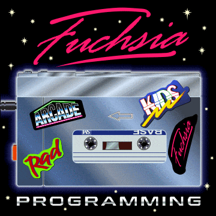</a></td>
      <td><a href="https://en.wikipedia.org/wiki/Battlestar_Galactica">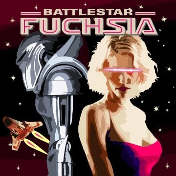</a></td>
      <td><a href="#">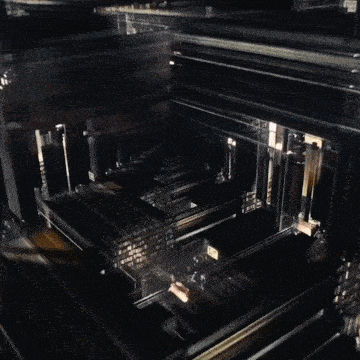</a></td>
    </tr>
    <tr>
      <td><a href="https://en.wikipedia.org/wiki/Doom_(franchise)">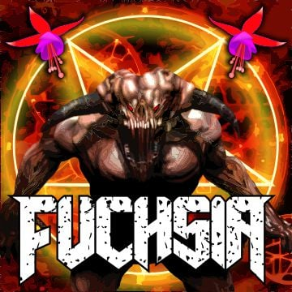</a></td>
      <td></td>
      <td><a href="https://en.wikipedia.org/wiki/Fringe_(TV_series)">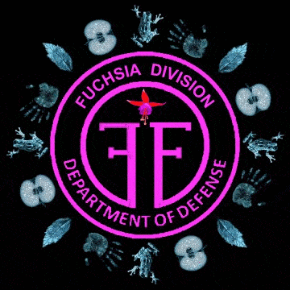</a></td>
    </tr>
    <tr>
      <td><a href="https://en.wikipedia.org/wiki/Inception">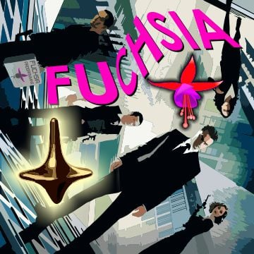</a></td>
      <td><a href="https://en.wikipedia.org/wiki/Sliders_(TV_series)">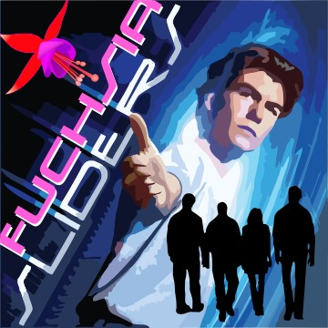</a></td>
      <td><a href="https://en.wikipedia.org/wiki/The_Walking_Dead_(TV_series)">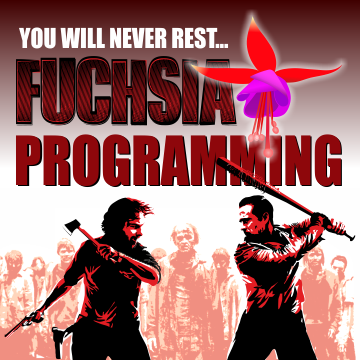</a></td>
    </tr>
  </table>

  <h2>Jorge Luis Araica Mazzei 🌍</h2>

  

