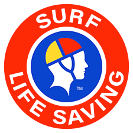

  <h1>Hi and Welcome !! 👋</h1>
  <h2>Management Team 👥</h2>

  <table>
    <tr>
      <td align="center">
        <a href="https://github.com/jbampton"> 
           
          <strong>CEO and Founder 🏢</strong> 
          John Bampton  
        </a>
      </td>
      <td align="center">
        <a href="https://github.com/johnbampton"> 
           
          <strong>Office Cleaner 🧹</strong> 
          Beast   
        </a>
      </td>
    </tr>
    <tr>
      <td colspan="2" align="center">
        <a href="https://github.com/BaseMax">
           
          <strong>Chief Technology Officer</strong> 
          Max Base
        </a>
      </td>
    </tr>
  </table>

  <h2>The Autobots will invite you on "Star" 🏎️ 🌠</h2>

Add a `⭐` to [this repository](https://github.com/john-bampton/.github) and Optimus Prime will auto invite you to join the `John Bampton` GitHub Organization ⏩ 🏦

---

The [Autobots](https://en.wikipedia.org/wiki/Autobot) are a faction of heroic, sentient robots from the planet Cybertron, who believe in freedom and justice for all life. Led by [Optimus Prime](https://en.wikipedia.org/wiki/Optimus_Prime), they are in a long-standing civil war with the evil Decepticons, who seek to conquer. The Autobots, often transforming into vehicles like cars and trucks, are known as "Autonomous Robotic Organisms" and are the protagonists in the Transformers, serving as defenders of Earth and allies to humans.

---

  <h1>🔝 Top charities & not-for-profits by Public Trust & Reputation 📢</h1>

  <a href="https://stjohn.org.au/">
    
     
    <strong>St John Ambulance Australia (SJAA)</strong>
  </a>

St John is a trusted, nation-wide provider of quality first aid, health, medical and wellbeing services and products. Providing help where and when you need it, and saving lives.

---

  <a href="https://sls.com.au/">
    
     
    <strong>Surf Life Saving Australia (SLSA)</strong>
  </a>

Surf Life Saving Australia (SLSA) is an Australian not-for-profit community organisation that promotes water safety and provides surf rescue services.
SLSA strives to create a safe environment on Australia's beaches and coastline through patrols, education and training, public safety campaigns and the promotion of health and fitness. 

---

  <a href="https://www.hollows.org/">
    
     
    <strong>The Fred Hollows Foundation</strong>
  </a>

The Fred Hollows Foundation is a non-profit aid organisation based in Sydney, Australia, which was founded in 1992, by eye surgeon Fred Hollows. The foundation focuses on treating and preventing blindness and other vision problems in people and communities. It operates in Australia, South East Asia, East Asia, the Middle East, and Africa.

---

  <a href="https://www.flyingdoctor.org.au/">
    
     
    <strong>The RFDS</strong>
  </a>

The RFDS is a national, charitable, health organisation delivering primary healthcare and 24-hour emergency services for those that live in rural and remote Australia.
Long known as one of the largest aeromedical organisations in the world, the RFDS delivers health care where mainstream health services are not available, using the latest in aviation, medical and communications technology and a broad-reaching ground-service fleet.
Supported by a vast number of volunteers and supporters, the RFDS provides a lifeline for those that live, work and travel in rural and remote Australia, and has been doing so for over nine decades.

---

  <a href="https://www.thesmithfamily.com.au/">
    
     
    <strong>The Smith Family</strong>
  </a>

At The Smith Family, we believe that education is one of the world’s most powerful change agents.
That’s why we focus on helping young Australians to overcome educational inequality caused by poverty. As a national, independent charity, every day we work with thousands of children and their families to help them unlock better futures for themselves.

---
